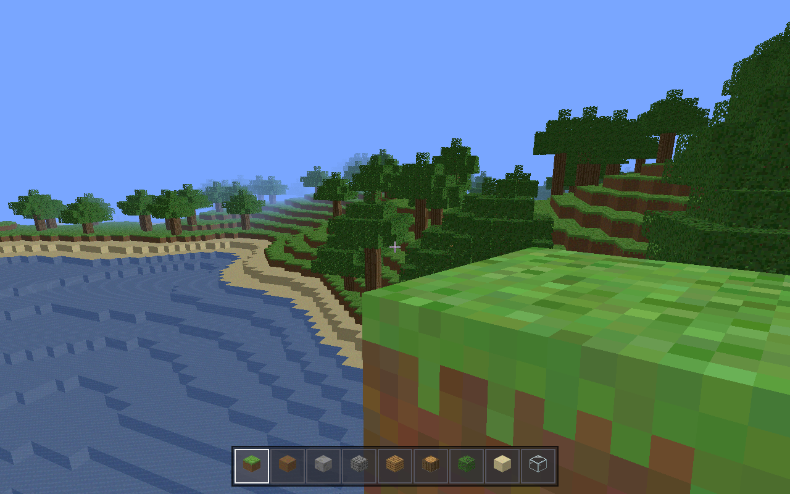

# Claudecraft

A browser-based, creative-mode voxel sandbox built with TypeScript + Three.js.
Selected block and entity textures come from the Faithful 64x Resource Pack
(see **Third-Party Assets** below), with original procedural textures as the
always-available fallback; all sound effects and music are generated
procedurally in code at runtime. Bundled third-party assets are the Faithful
textures and the pixel UI font (Pixelify Sans, SIL OFL —
`src/assets/fonts/`); the logo, skin, and favicon are project image assets in
`docs/`.



## Running

```sh
npm install
npm run dev
```

Open the printed URL (default `http://localhost:5173`) and click **Play**.

Vibrant Visuals starts **off**. The default render distance is **12 chunks**
and can be adjusted from **2–16 chunks** in Settings.

## Player skins

The main menu shows a live 3D preview of the current player skin on the right,
under an editable **username** box (default **Claude**, persisted), above an
**Upload Skin** button. Skins use the standard Minecraft Java **64×64** layout
(classic 4px arms); the selected skin renders on both the menu preview and the
in-game first-person hand, and persists across reloads.

- Default skin: place a 64×64 PNG at `docs/skin.png`. If it is missing or not
  64×64, the game logs a warning and uses a generated fallback character.
- Upload: click **Upload Skin** and choose a 64×64 PNG. Non-PNG, wrong-size, or
  unreadable files are rejected with a clear on-screen message.

## Controls

| Input | Action |
|---|---|
| Mouse | Look (click the world to capture the pointer) |
| `W` `A` `S` `D` | Move |
| `Space` | Jump (hold to keep hopping) |
| `Space` ×2 | Toggle creative flight |
| `Space` / `Shift` (flying) | Fly up / down |
| `Ctrl` or `W` ×2 | Sprint |
| Left click | Break block |
| Right click | Read an etched lore stone, otherwise place block |
| `1`–`9` / mouse wheel | Select hotbar slot |
| `F3` | Debug overlay (FPS, coordinates, biome, time, passive mob counts) |
| `Esc` | Pause menu |

## What's inside

- Fixed 20 Hz simulation with interpolated rendering; Minecraft-faithful
  movement constants (walk 4.317 m/s, sprint 5.612 m/s, jump 0.42 blocks/tick,
  gravity 0.08, drag ×0.98 → ≈1.25-block jumps).
- Seeded climate terrain with Plains, Forest, Birch Forest, Taiga, Snowy
  Plains, Desert, Savanna, Swamp, Ocean, Warm Ocean, and Frozen Ocean.
  Biomes supply characteristic snow, ice, sand, cactus, tree species, and
  deterministic grasses, flowers, ferns, bushes, and dry foliage.
- Biome-aware passive animals: cows, pigs, sheep, and chickens spawn in small
  deterministic groups on valid natural surfaces. They idle, look around,
  wander, step over block terrain, avoid water and drops, recover when stuck,
  use warm/cold/temperate Faithful variants where available, and make unique
  synthesized distance-attenuated calls. Sheep wool colors are climate
  weighted.
- Deterministic, biome-aware generated structures: settler villages, desert sun
  temples, forest waystones, mountain watchtowers, coastal ruins, cairns,
  buried archives, Cloudwright obelisks, and rare ancient gates. Cross-chunk
  structures are resolved per chunk, so they remain complete regardless of
  chunk load order.
- A subtle original Cloudwright lore thread is told through repeated four-stone
  alignments, sky-glass accents, hidden rooms, and etched stones. Right-click an
  etched stone to read a short location-stable fragment.
- A 20-minute day/night cycle: keyframed sky and fog, sun, moon, stars, and
  unified face-culled 3D clouds drifting at y=128.
- Vanilla-style voxel shading is always active: smooth per-vertex ambient
  occlusion, soft sun/moon shadows, and anti-aliased geometry. A uniform
  ambient floor plus reduced shadow intensity keep shadowed daytime surfaces
  readable — they add depth without crushing to black.
- Optional Vibrant Visuals is a cosmetic enhancement layer: a gentle filmic
  tone curve (Neutral), bloom, a sun halo, stronger atmospheric lighting, and
  cloud shadows. It changes no gameplay (collision, reach, ticks, terrain).
- Water is blocky and vanilla-style in both modes: the procedural water tile,
  semi-transparent and tinted per biome (murky swamps, cyan warm oceans, deep
  frozen oceans) using stable Minecraft Java 26.1.2 values; colors blend at
  biome boundaries and the surface stays visible from below. The water tile
  animates with a subtle drifting ripple (the atlas tile is repainted on a tick
  cadence — no chunk remeshing). Entering, leaving, swimming through, and
  submerging in water play synthesized splash/stroke/ambience sounds that
  follow the SFX volume.
- Terrain is shaped by a continentalness spline (deep varied oceans → shelves →
  coasts → inland plateaus), erosion-modulated relief, and occasional weirdness
  ridges, so the world has deep oceans, natural shorelines, rolling hills, and
  mountains rather than a uniform shallow heightmap.
- Biomes form coherent climate regions from smooth temperature, humidity,
  continentalness, erosion, and weirdness fields; a transition dither frays
  surface borders so they interleave instead of cutting in a straight line, and
  extreme biomes never touch (no sand beside snow — cold coasts keep snow/grass
  instead of sand beaches). Sand beaches appear only beside real water; deserts
  and submerged beds are the only other sources of sand.
- Submerged beds use coherent sand/dirt/gravel patches (shallow shores sandy,
  deeper basins exposing dirt and gravel). Dirt and the new Gravel block are
  both procedurally textured; Gravel is generated on lake/ocean/river beds.
- Procedural 16×16 block and alpha-cutout plant textures painted onto a
  half-texel-safe atlas at startup; all sound effects and the ambient music
  loop are synthesized with the Web Audio API.

## Third-Party Assets

### Faithful 64x Resource Pack

Claudecraft uses selected block and entity textures from the **Faithful 64x
Resource Pack**. Blocks include grass, dirt, stone, cobblestone, sand, gravel,
oak/birch/spruce/acacia wood and leaves, glass, water, snow, ice, and cactus.
Entities include adult cow, pig, sheep, and chicken textures and available
climate variants. The local pack lives in `texturepack/` and is read at build
time; nothing is downloaded at runtime. If a mapped texture is missing or
invalid, the game falls back to an original procedural texture, so it always
boots.

Faithful Resource Pack is created by HARYA_ and the Faithful Resource Pack
community. Website: https://faithfulpack.net/

Faithful textures are used under the **Faithful License (Version 3)**; the
unmodified license is bundled at `THIRD_PARTY_LICENSES/FAITHFUL_LICENSE.txt`.
See [`CREDITS.md`](CREDITS.md) for the specific files used.

Claudecraft is not an official Minecraft product and is not approved by or
associated with Mojang, Microsoft, or Faithful Resource Pack. Claudecraft is not
monetized.

## Project docs

- `PLAN.md` — the build specification.
- `TODO.md` — the phased task list (all phases verified in-browser).
- `DECISIONS.md` — deviations and notable implementation decisions.
- `scripts/` — headless-browser acceptance checks used to verify each phase.
