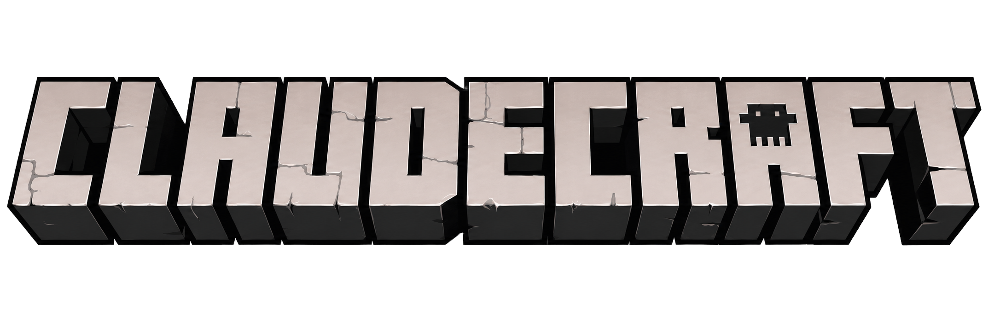
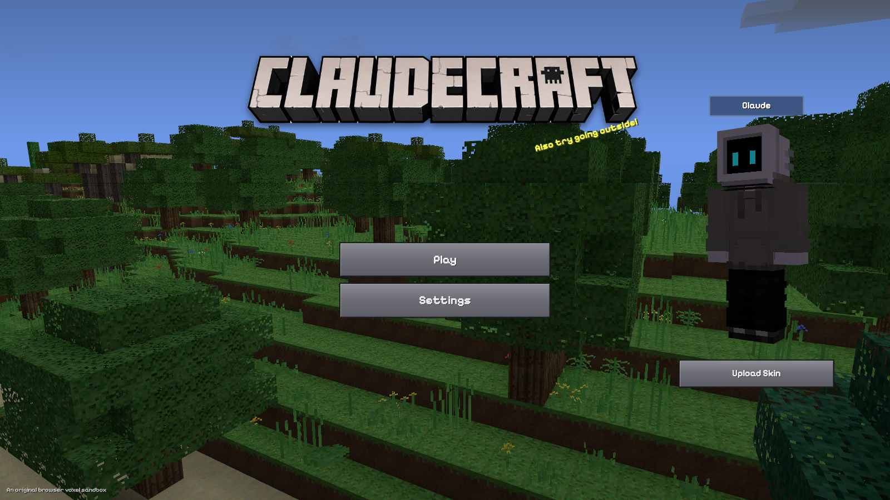
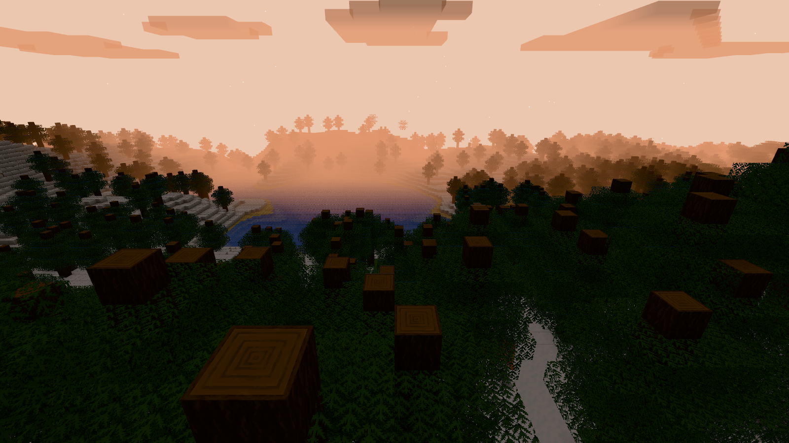
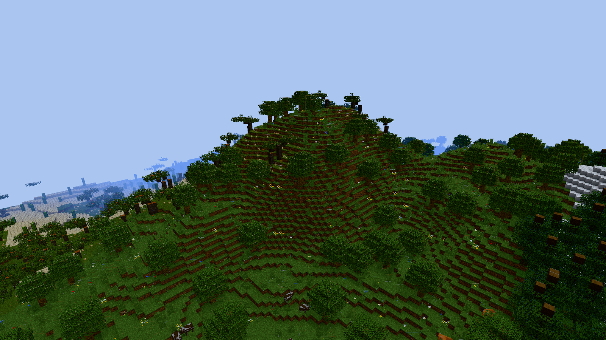
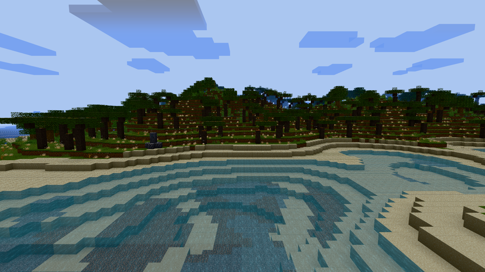
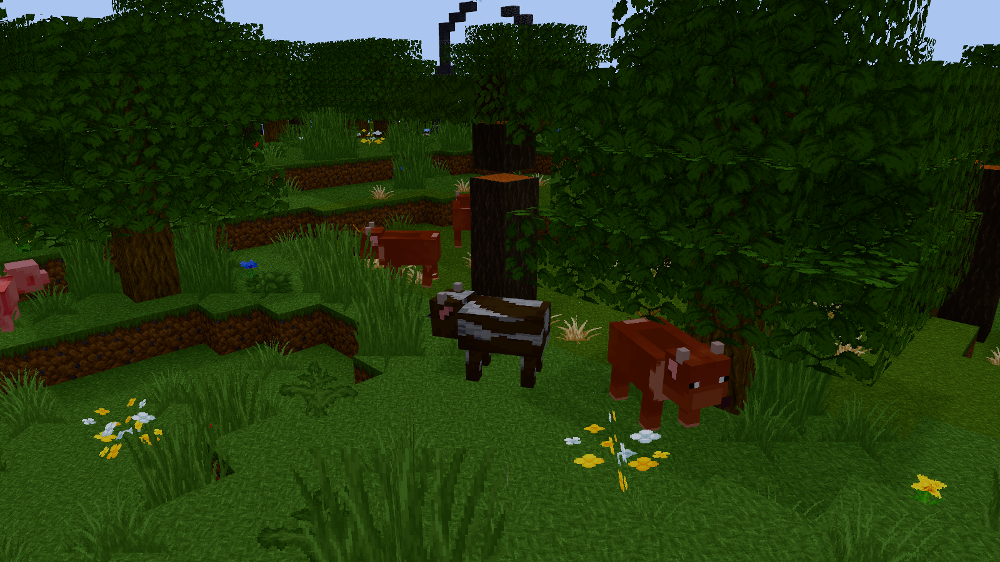
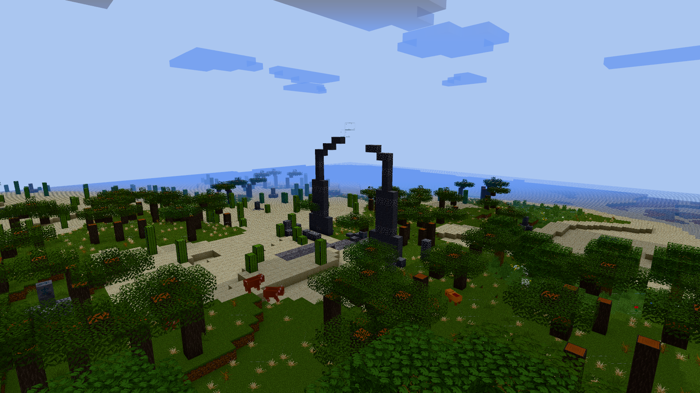

# Claudecraft

<p align="center">
  
</p>

<p align="center">
  <strong>A single-player creative voxel sandbox built for the browser with TypeScript, Three.js, procedural worlds, passive mobs, and generated structures.</strong>
</p>

<p align="center">
  <a href="package.json"></a>
  <a href="package.json"></a>
  <a href="package.json"></a>
  <a href="LICENSE"></a>
</p>

<p align="center">
  
</p>

## Overview

Claudecraft is an independent Minecraft-inspired sandbox focused on creative
building, exploration, and procedural atmosphere. It runs entirely in the
browser: the terrain is generated from a seed, chunks stream around the player,
animals populate suitable biomes, and structures carry a light environmental
story about the Cloudwrights.

The current `0.1.0` build is a playable technical project rather than a
Minecraft-compatible client. It has no survival loop, crafting, multiplayer, or
world persistence. The emphasis is a polished single-player creative
experience, an original browser voxel engine, and reproducible in-browser
verification.

## Screenshots

The gallery below contains unedited captures from the running game at 1600x900.
Vibrant Visuals and the optional Faithful 64x texture pack were enabled for
these scenes.

<table>
  <tr>
    <td width="50%">
      
      <br><sub><strong>Sunrise and atmosphere</strong></sub>
    </td>
    <td width="50%">
      
      <br><sub><strong>Terrain and biome depth</strong></sub>
    </td>
  </tr>
  <tr>
    <td width="50%">
      
      <br><sub><strong>Water and biome transitions</strong></sub>
    </td>
    <td width="50%">
      
      <br><sub><strong>Passive mobs</strong></sub>
    </td>
  </tr>
  <tr>
    <td colspan="2">
      
      <br><sub><strong>Generated Ancient Gate and Cloudwright lore</strong></sub>
    </td>
  </tr>
</table>

See [docs/screenshots/README.md](docs/screenshots/README.md) for capture
standards and the reproducible screenshot workflow.

## Features

- **Creative voxel gameplay:** first-person movement, sprinting, sneaking,
  swimming, creative flight, instant block breaking, block placement, and a
  fixed nine-slot hotbar.
- **Procedural world generation:** seeded terrain shaped by continentalness,
  erosion, weirdness, temperature, and humidity fields with progressively
  streamed 16x16 chunks.
- **Eleven biome types:** Plains, Forest, Birch Forest, Taiga, Snowy Plains,
  Desert, Savanna, Swamp, Ocean, Warm Ocean, and Frozen Ocean.
- **Living environments:** biome-specific trees and foliage, animated water,
  underwater rendering, a 20-minute day/night cycle, sun, moon, stars, and
  drifting 3D clouds.
- **Passive animals:** cows, pigs, sheep, and chickens with deterministic group
  spawning, climate variants, lightweight local behavior, and synthesized
  calls.
- **Generated structures:** villages, temples, ruins, waystones, cairns,
  watchtowers, obelisks, buried archives, and rare Ancient Gates, including
  stable etched-stone lore fragments.
- **Two visual profiles:** a polished vanilla-style baseline plus optional
  Vibrant Visuals with tone mapping, bloom, atmospheric lighting, and cloud
  shadows.
- **Procedural-first art:** original generated block, foliage, water, and animal
  textures are the default. Selected Faithful 64x textures can be enabled in
  Settings and fall back safely if unavailable.
- **Custom interface and skins:** live panorama main menu, settings and pause
  screens, editable username, 3D player preview, and validated 64x64 PNG skin
  upload with local persistence.
- **Synthesized audio:** ambient music, footsteps, block interactions, water
  movement, UI feedback, and animal calls are generated at runtime with the Web
  Audio API.

## Quick Start

### Prerequisites

- Node.js `20.19+` or `22.12+`
- npm
- A modern browser with WebGL 2 and hardware acceleration

### Install and Run

```sh
git clone https://github.com/MusaMisto/claudecraft.git
cd claudecraft
npm install
npm run dev
```

Open the local URL printed by Vite, then select **Play**.

The default render distance is 12 chunks. Vibrant Visuals and the Faithful 64x
Pack both start disabled and can be enabled independently from **Settings**.

## Controls

| Action | Input |
|---|---|
| Look / capture pointer | Mouse / click the world |
| Move | `W` `A` `S` `D` |
| Jump | `Space` |
| Toggle creative flight | Double-tap `Space` |
| Fly up / down | `Space` / `Shift` |
| Sprint | `Ctrl` or double-tap `W` |
| Sneak | `Shift` while not flying |
| Break block | Left click |
| Place block | Right click |
| Read an etched lore stone | Right click while targeting it |
| Select hotbar slot | `1`-`9` or mouse wheel |
| Toggle debug overlay | `F3` |
| Pause | `Esc` |

## Gameplay Systems

### World and Biomes

Terrain generation combines broad climate regions with coastlines, ocean
shelves, inland plateaus, ridges, and erosion-shaped relief. Biomes control
surface blocks, vegetation, tree species, animal variants, and water color.
Cross-chunk generation remains deterministic for a fixed seed.

### Rendering and Atmosphere

Chunk meshes use face culling, vertex ambient occlusion, biome tinting, hard
voxel geometry, directional shadows, and anti-aliasing. Water animates by
repainting its atlas tile without remeshing chunks. The optional Vibrant
profile adds a multisampled post-processing path while preserving gameplay.

### Mobs and Structures

Passive mobs use fixed-tick voxel physics, simple wander and avoidance states,
spawn caps, and deterministic chunk populations. Structures are planned in
seeded regions and applied independently to every intersecting chunk, so large
landmarks do not depend on chunk load order.

### Audio and Player Identity

All gameplay audio is synthesized in code. Uploaded player skins use the
classic-arm 64x64 PNG layout and update both the menu model and the first-person
arm. The selected skin and username are stored locally in the browser.

## Tech Stack

| Area | Technology |
|---|---|
| Language | TypeScript 6 in strict mode |
| Build tooling | Vite 8 |
| Rendering | Three.js r184 and WebGL 2 |
| Procedural noise | `simplex-noise` |
| UI | Plain HTML and CSS overlays |
| Audio | Web Audio API |
| Textures | Canvas-generated atlas with optional Faithful 64x sources |
| Browser checks | `puppeteer-core` with headless Chromium/Brave |

## Project Structure

```text
src/
  assets/       Bundled project assets and font
  audio/        Music, effects, water, and animal synthesis
  core/         Input, fixed-timestep loop, RNG, and events
  entities/     Passive mobs, spawning, AI, physics, and rendering
  player/       Player state, movement, skins, and block interaction
  rendering/    Chunk meshes, textures, sky, clouds, lighting, and viewmodel
  settings/     Runtime settings state
  ui/           Main menu, pause/settings screens, HUD, and overlays
  world/        Chunks, terrain, biomes, foliage, and structures
docs/
  screenshots/  README gallery and capture notes
scripts/        Headless acceptance, soak, and capture scripts
texturepack/    Local Faithful 64x source files used by the optional pack
THIRD_PARTY_LICENSES/
```

Architecture and implementation decisions are documented in
[PLAN.md](PLAN.md), [TODO.md](TODO.md), and [DECISIONS.md](DECISIONS.md).
Focused audit documents in the repository root record validation for rendering,
terrain, skins, passive mobs, textures, and structures.

## Development

| Command | Purpose |
|---|---|
| `npm run dev` | Start the Vite development server |
| `npm run build` | Run the strict TypeScript check and production build |
| `npm run preview` | Preview the production build locally |
| `npm run check:structures` | Run deterministic structure acceptance checks |
| `npm run soak:structures` | Run the extended structure traversal soak |

Additional browser checks live in `scripts/`. With the development server
running on port 5173, examples include:

```sh
node scripts/browser-check.mjs
node scripts/phase4-check.mjs
node scripts/passive-mobs-check.mjs
node scripts/capture-readme-screenshots.mjs
```

## Project Status

Claudecraft currently targets a self-contained creative sandbox. These
limitations are intentional and should not be presented as implemented
features:

- No world save/load or persistent block edits.
- No multiplayer or networking.
- No survival mode, health, hunger, combat, crafting, or inventory screen.
- No compatibility with Minecraft worlds, servers, mods, or resource packs.

Future work is tracked through `TODO.md` and `DECISIONS.md`. Larger content such
as the deferred Cloudheart Ruin may be explored later, but there is no committed
release roadmap for persistence, survival, or multiplayer.

## Troubleshooting

- **Audio is silent:** interact with the page once. Browsers require a user
  gesture before starting an `AudioContext`.
- **Startup or chunk streaming feels slow:** lower Render Distance in Settings
  and confirm browser hardware acceleration is enabled.
- **The optional texture pack does not load:** Claudecraft logs the problem and
  continues with procedural textures.
- **The page is blank:** use a current WebGL 2 browser, check the developer
  console, and verify `npm run build` succeeds.

## Credits and Third-Party Assets

### Faithful 64x Resource Pack

Claudecraft can optionally use selected block, foliage, water, and passive-mob
textures from the [Faithful 64x Resource Pack](https://faithfulpack.net/).
Faithful is created by HARYA_ and the Faithful Resource Pack community. The
pack is disabled by default and no texture is downloaded at runtime.

The selected textures are used under the
[Faithful License, Version 3](THIRD_PARTY_LICENSES/FAITHFUL_LICENSE.txt). That
license requires attribution and prohibits monetizing content that includes
Faithful work. See [CREDITS.md](CREDITS.md) for the exact mapped files and
fallback behavior.

### Pixelify Sans

The interface bundles Pixelify Sans under the SIL Open Font License 1.1. Its
license is included at
[src/assets/fonts/PixelifySans-OFL.txt](src/assets/fonts/PixelifySans-OFL.txt).

The voxel engine, procedural fallback art, UI implementation, models, world
generation, structures, lore, sound effects, and music are original Claudecraft
work. The project logo, favicon, and default skin are bundled project assets.

## Contributing

Contributions are welcome. See [CONTRIBUTING.md](CONTRIBUTING.md) for setup,
validation, pull request, and asset-licensing guidance. In brief:

1. Open an issue before large architectural or content changes.
2. Keep changes focused and consistent with the existing TypeScript modules.
3. Run `npm run build` and the relevant browser checks.
4. Include validation for changes to shared world, rendering, or entity logic.
5. Respect all third-party licenses and do not submit copied Mojang assets,
   code, audio, or other material without clear redistribution rights.

## License

Claudecraft source code and original project materials are available under the
[MIT License](LICENSE).

Third-party assets remain under their own licenses and are not relicensed by
the project MIT license. See [CREDITS.md](CREDITS.md),
[THIRD_PARTY_LICENSES/](THIRD_PARTY_LICENSES/), and the bundled font license for
details.

## Disclaimer

Claudecraft is an independent Minecraft-inspired voxel sandbox. It is not an
official Minecraft product and is not approved by or associated with Mojang,
Microsoft, or Faithful Resource Pack.
